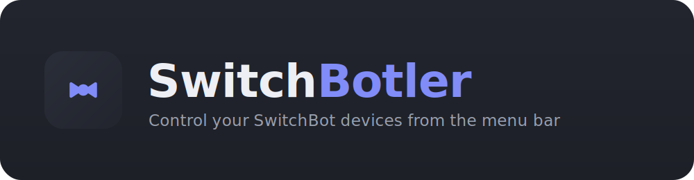
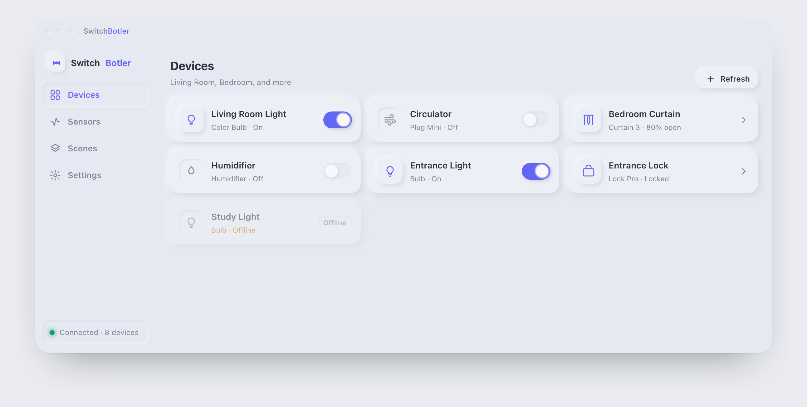
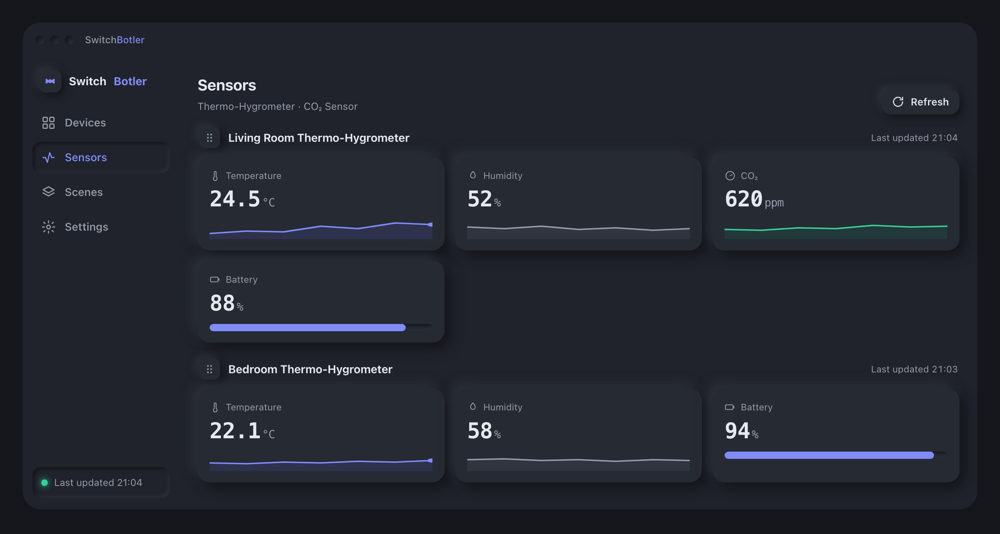
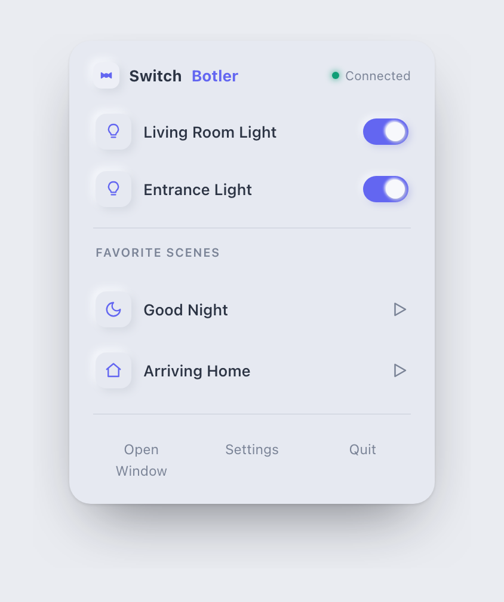

<p align="center">
  
</p>

<p align="center">
  SwitchBot API を使って、デスクトップから SwitchBot デバイスを操作するクロスプラットフォームアプリ
</p>

<p align="center">
  <a href="https://github.com/douhashi/SwitchBotler/releases">⬇&nbsp;ダウンロード</a>&nbsp;·&nbsp;
  <a href="#スクリーンショット">スクリーンショット</a>&nbsp;·&nbsp;
  <a href="LICENSE">MIT License</a>
</p>

**SwitchBotler**（スイッチボトラー）は、SwitchBot Cloud API v1.1 を利用して SwitchBot デバイスを Windows / macOS / Linux から操作するデスクトップアプリケーション。システムトレイ常駐 + グローバルショートカットで、PC の作業机から手を離さずにデバイスを操作できる軽量ユーティリティを目指す。

## 特徴

- 🖥️ **クロスプラットフォーム** — Windows / macOS / Linux で同じ UI
- 🪶 **軽量** — Tauri v2 採用でバンドル 3〜10MB・低メモリ
- 🔒 **安全** — Token / Secret は OS のセキュアストレージに保管し、署名生成・API 呼び出しは Rust 側で完結
- 🎛️ **手元の即時操作** — トレイ常駐からデバイス操作・シーン実行

## ダウンロード

[**最新版をダウンロード（Releases）**](https://github.com/douhashi/SwitchBotler/releases) — Windows / macOS / Linux 向けのインストーラを配布しています（現在は未署名）。

## スクリーンショット

<p align="center">
  <br>
  <sub>デバイス一覧 — ライトテーマ</sub>
</p>

<p align="center">
  <br>
  <sub>センサーステータス — ダークテーマ</sub>
</p>

<p align="center">
  <br>
  <sub>トレイメニュー（お気に入り）</sub>
</p>

> 全 6 画面のモックアップは [`docs/mockup/index.en.html`](docs/mockup/index.en.html)（英語）/ [`docs/mockup/index.html`](docs/mockup/index.html)（日本語）をブラウザで開くと確認できます。

## 技術構成

Tauri v2 + Rust（バックエンド） / React 19 + TypeScript + Vite + Tailwind CSS v4 + Zustand（フロントエンド）。
詳細は [`docs/development/architecture.md`](docs/development/architecture.md) を参照。

## 開発環境のセットアップ

ツールチェーンは [mise](https://mise.jdx.dev/) で管理する（Node.js 24 系 / Rust stable / lefthook）。

```sh
mise install     # Node.js・Rust・lefthook を導入
mise run setup   # npm install + git hooks（lefthook）の有効化
mise run dev     # Tauri アプリを開発モードで起動
```

そのほかの主なタスク:

| タスク | 内容 |
|---|---|
| `mise run lint` | 型チェック + Rust fmt-check + clippy を一括実行 |
| `mise run typecheck` | フロントエンドの型チェック（`tsc --noEmit`） |
| `mise run fmt` | Rust コードの整形 |
| `mise run clippy` | Rust の静的解析 |

git hooks は commit 時に Rust 整形チェックと型チェック、push 時に clippy を実行する。

## ドキュメント

- **ビジネス**: [プロジェクト概要](docs/business/overview.md) / [OSS・ライセンス・商標](docs/business/model.md)
- **開発**: [アーキテクチャ](docs/development/architecture.md) / [SwitchBot API](docs/development/switchbot-api.md) / [セキュリティ方針](docs/development/security.md) / [ロードマップ](docs/development/roadmap.md) / [開発フィロソフィー](docs/development/philosophy.md)

## ライセンス

[MIT](LICENSE)

## ディスクレーマー

SwitchBotler is an unofficial, community-built application and is not affiliated with, endorsed by, or sponsored by SwitchBot (Wonderlabs, Inc.). "SwitchBot" is a trademark of its respective owner.
